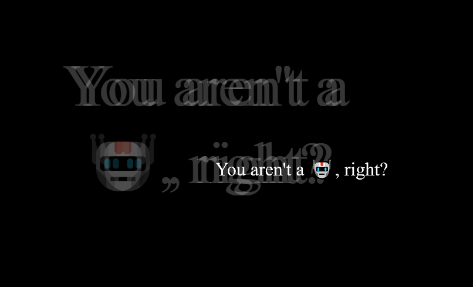

# ALLES! CTF 2021: Sanity Check

**Category**: web, **Difficulty**: easy, **Author**: fionera, **Points**: 104

The text for the challenge was: *You aren't a 🤖, right?*

When the challenge is entered, a web page is displayed containing one sentence, which is displayed twice, with a black background.

The sentence that is blurred is animated and flickering in place and at times moving down to the right and back. The source code had nothing out of the ordinary, but the page was received with the error code: *418 I'm a teapot*.

After the animation was admired, we added */robots.txt* to the end of the URL, which many tutorials explain that should be one of the first things you try. The file did exist, and it only contained one line - the flag.

#### Debrief

The challenge was pretty easy and a nice start to the CTF. Everyone with a bit of experience in CTF's, computer science or/and in web development, will have a easy time with this challenge.

After the challenge a teammate realised the phrase used in this challenge, which has a robot emoji :robot:, is clearly a reference to the robots.txt file. 

